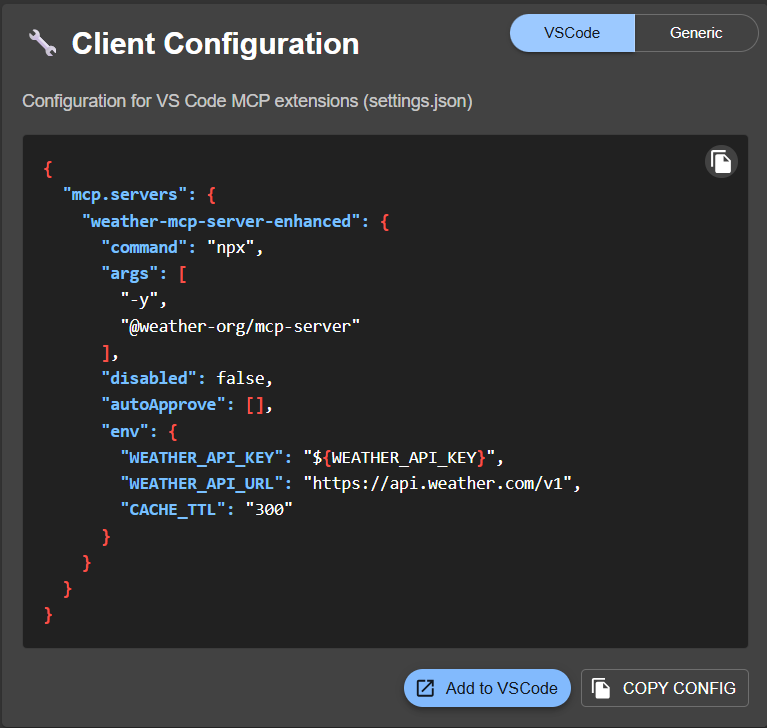
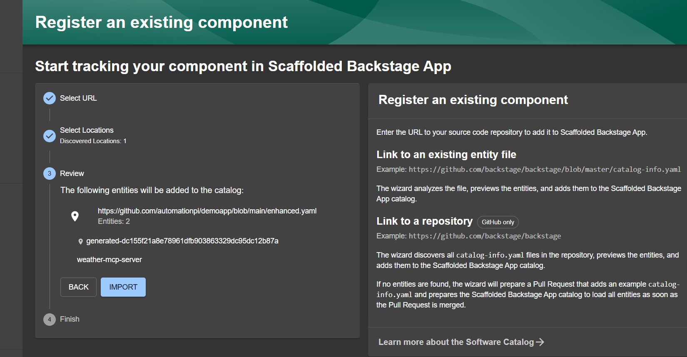
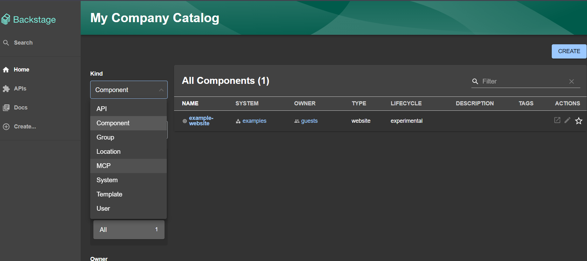
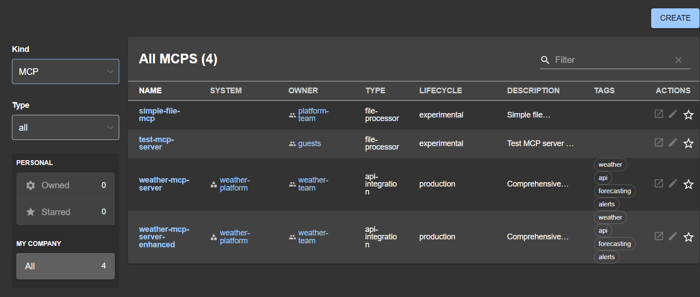
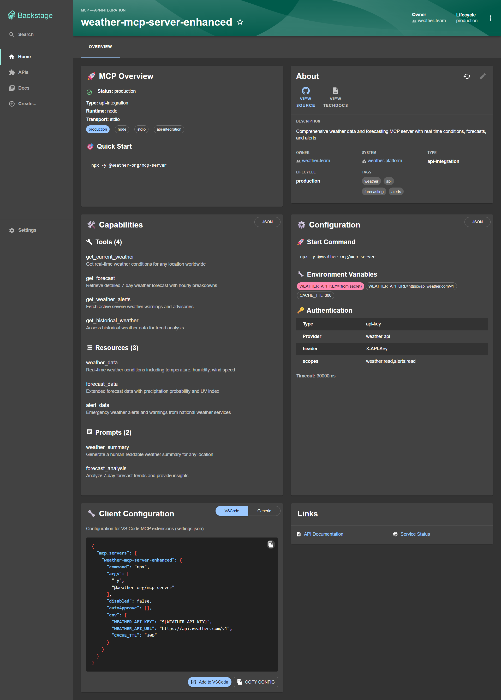

A Backstage frontend plugin that visualizes Model Context Protocol (MCP) servers with rich UI components. This plugin allows backstage to centrally manage, discover, and collaborate around MCP entities directly from your Backstage catalog.

[](https://www.npmjs.com/package/@mexl/backstage-plugin-mcp-frontend)
[](https://opensource.org/licenses/Apache-2.0)

## Prerequisites

**Important:**  
You must first install the backend plugin [`@mexl/backstage-plugin-catalog-backend-module-mcp`](https://www.npmjs.com/package/@mexl/backstage-plugin-catalog-backend-module-mcp). See its setup guide for full configuration steps.

## Features

- Interactive MCP entity overview and management
- Open and edit MCP server configurations in VSCode
- Enhanced UI cards for MCP entities



Open and edit MCP server configurations directly in VSCode.

## Getting Started

### 1. Install the Frontend Plugin

From your Backstage app directory:

```sh
yarn --cwd packages/app add @mexl/backstage-plugin-mcp-frontend
```

### 2. Enable on Entity Page

Edit `packages/app/src/components/catalog/EntityPage.tsx`:

```tsx
import { MCPEntityPage } from '@mexl/backstage-plugin-mcp-frontend';

export const entityPage = (
  <EntitySwitch>
    <EntitySwitch.Case if={isKind('component')} children={componentPage} />
    <EntitySwitch.Case if={isKind('api')} children={apiPage} />
    {/* Add this line: */}
    <EntitySwitch.Case if={isKind('MCP')} children={<MCPEntityPage />} />
    <EntitySwitch.Case>{defaultEntityPage}</EntitySwitch.Case>
  </EntitySwitch>
);
```

### 3. Restart Backstage

```sh
yarn start
```

MCP entities will now display with enhanced UI cards.

## Example: Complete Setup

You can explore a full example catalog containing systems, users, groups, and MCP entities:

```sh
cp examples/complete-setup/catalog-info.yaml catalog-info/complete-example.yaml
```

This example demonstrates real-world integration patterns with Backstage, system relationships, UI enhancements, and support for multiple MCP transport types.

## Customization

For advanced layouts, import individual cards and use them in your own pages:

```tsx
import {
  MCPOverviewCard,
  MCPCapabilitiesCard,
  MCPConfigurationCard,
  MCPClientConfigCard,
} from '@mexl/backstage-plugin-mcp-frontend';
```

Example with Material-UI Grid:

```tsx
<Grid container spacing={3}>
  <Grid item md={6}><MCPOverviewCard /></Grid>
  <Grid item md={6}><MCPCapabilitiesCard /></Grid>
</Grid>
```

### Screenshots

<div align="center">
  
  <p><em>Import new MCP entitiy interface</em></p>

  
  <p><em>Showing MCP kind in catalog</em></p>

  
  <p><em>Browse and manage your MCP entities backstage view</em></p>

  
  <p><em>Comprehensive MCP entity overview with interactive components</em></p>
</div>


## Adding MCP Entities

To add new MCP entities:

1. Choose or author a configuration (see examples).
2. Copy it to your catalog directory.
3. Import via the Backstage UI or your catalog config.

## Contributing

We welcome contributions! Please fork the repo, create a branch, add tests, ensure all tests pass, and submit a pull request.

## License

Apache-2.0

## Related Packages

- Backend: [`@mexl/backstage-plugin-catalog-backend-module-mcp`](https://www.npmjs.com/package/@mexl/backstage-plugin-catalog-backend-module-mcp)
- Backstage: [https://backstage.io](https://backstage.io)
- Model Context Protocol: [https://modelcontextprotocol.io](https://modelcontextprotocol.io)


